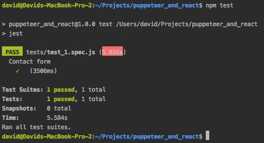

# Puppetter + Jest

Based on the article available at [end-end-tests-dont-suck-puppeteer](https://ropig.com/blog/end-end-tests-dont-suck-puppeteer/) and here [User Interface Testing with Jest and Puppeteer](https://www.valentinog.com/blog/ui-testing-jest-puppetteer/).

## Install
`git@github.com:davidjeddy/ui-testing-jest-puppetteer.git`

## Setup
`npm i jest puppeteer faker --save-dev`

`npm i babel-core babel-jest babel-preset-env --save-dev`

## Usage
`npm test`

## Output
Terminal:

Image (./tests/_output/...):

